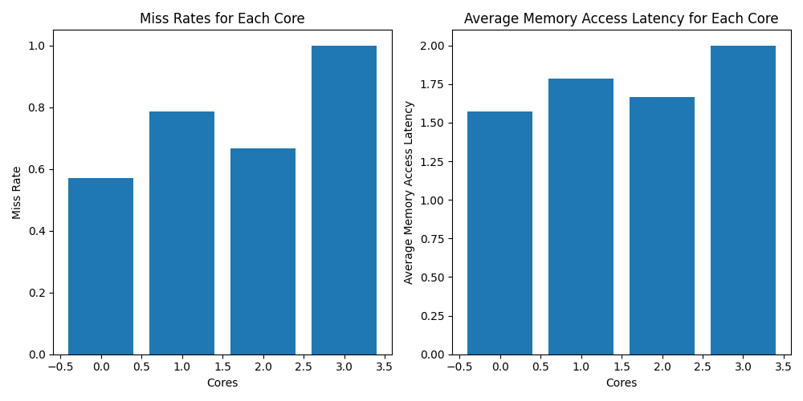
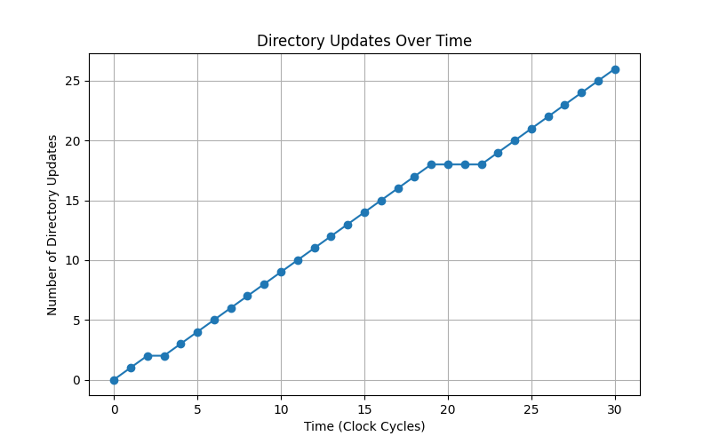

# Directory-based Cache Coherence Simulation

## Team
1. [Charvi Jindal](https://github.com/charvijindal) (2020045)
2. [Chetan](https://github.com/chetanch31) (2020046)
3. [Jogith S. Chandran](https://github.com/jogithschan) (2020072)
4. [Krishmeet Singh](https://github.com/Krishmeet-10) (2020441)


## Instructions

To ensure smooth execution of the directory-based cache coherence simulation, follow these steps:

### Setting Up Virtual Environment

1. Create a new virtual environment:

    ```bash
    python -m venv env_name
    ```

2. Activate the virtual environment:

    - **Windows**

        ```bash
        env_name\Scripts\activate
        ```

    - **Unix or MacOS**

        ```bash
        source env_name/bin/activate
        ```

### Installing Required Libraries

3. Install necessary libraries using the `requirements.txt` file:

    ```bash
    pip install -r requirements.txt
    ```

### Running the Simulation

4. Execute the main script:

    ```bash
    python main.py
    ```


## About Coherency

Coherency ensures data consistency across multiple cores in a multi-core processor. Each core maintains its local cache, storing copies of data from the main memory. Coherency mechanisms guarantee a uniform view of shared data among cores executing different threads simultaneously.

## Directories in Cache Coherence

Directories in network architectures maintain data coherency among cores. In this project, we employ a directory entry for each memory block, organizing it based on a specific format.


## Coherency Protocol: MOSI

The MOSI protocol ensures data coherency through different states:

| State Symbol | State Binary | State Description        |
|--------------|--------------|--------------------------|
| M            | 00           | Modified - Data is up-to-date and exclusively owned by the core |
| S            | 01           | Shared - Read-only copy shared by at least 2 cores |
| I            | 10           | Invalidated - A copy of an address in state M invalidates the same address for other cores |
| O            | 11           | Owned - Every cached entry has an owning core with the latest, read-only copy of the data |

## Project Description

This project simulates directory-based cache coherence across cores. Each core follows a set of instructions to interact with the cache controller for data fetching.

### Cache and Memory Organization

1. Main-memory: 64 address locations; each L1 cache contains 4 address locations.
2. Initialize memory array with zeros.
3. Cache line width: 1 byte (byte-addressable).
4. L1 caches: 2-way set-associative; LRU replacement policy.
5. L1 cache controller: Write-through policy for immediate data modification.

## Requests, Transactions, and Responses

Transactions between the cache and directory controllers facilitate read/write access and maintain coherence. Transactions are initiated by cores and handled by the cache controller.

### Valid Transactions

| Instruction   | Transaction                                              | Description                                                                       |
|---------------|----------------------------------------------------------|-----------------------------------------------------------------------------------|
| GetShared     | LS                                                        | Read-only access to a shared address location; assign ownership if unassigned      |
| GetModified   | LM, ADD                                                   | Read-write access; ownership of the address along with the latest copy from owner  |
| Put           | IN, LM, ADD                                               | Invalidate local copy; evict data block from cache to main memory in the next cycle |

## Implementation details
The implemented system comprises 4 cores, with each core housing an L1 cache following a 2-way set associativity and LRU replacement policy. Additionally, the caches enforce a write-through policy to manage data modifications.

### Classes created and their functions
#### CacheSet
- `__init__(self)`: Initializes a cache set with two cache lines implementing a 2-way set associative structure.
- `find(self, tag)`: Searches for a specific tag within the cache lines.
- `update(self, index, tag, data)`: Updates the cache set based on index, tag, and data.

#### L1Cache
- `__init__(self, sets)`: Initializes an L1 cache with a specified number of sets.
- `get_lru_index(self, cache_set)`: Retrieves the least recently used index within a cache set.

#### L1CacheController
- `__init__(self, interconnect, num)`: Initializes an L1 Cache Controller.
- `setCacheControllerInterconnect(self, interconnect)`: Sets the interconnect for the Cache Controller.
- Other methods: `getDirectory`, `read`, `write`, `getShared`, `getModified`, `putInvalid`, `getCacheMemoryDump`: Provide functionalities for cache operations and coherence management.

#### Interconnect
- `__init__(self, directory_controller, cores)`: Initializes an Interconnect instance with a directory controller and a list of cores.
- `read_from_memory(self, addr)`, `write_to_memory(self, addr, val)`, `core_dump(self)`, `get_directoryLine(self, addr)`, `set_directoryLine(self, line, addr)`, `getValueFromCore(self, addr, owner)`,`make_directory_dump(self, dump_inst, addr)`, `make_main_memory_dump(self, addr)`

#### Core
- `__init__(self, interconnect, num)`: Initializes a Core with an interconnect and a unique identifier.
- `setInterconnect(self, interconnect)`: Sets the interconnect for the Core.
- `interpret_instruction(self, instruction)`: Interprets different instructions, interacts with the cache controller, and manages cache memory dumps.

#### Directory
- `__init__(self)`: Initializes a directory with 64 entries, each comprising a state, owner, and sharer list.

#### DirectoryController
- `__init__(self)`: Initializes a Directory Controller instance.
- `get_line(self, addr)`: Retrieves the directory entry corresponding to the provided address.
- `set_line(self, line, addr)`: Sets the directory entry for the given address with the provided line.

## Results
### Average memory access latency



### Directory Updates


